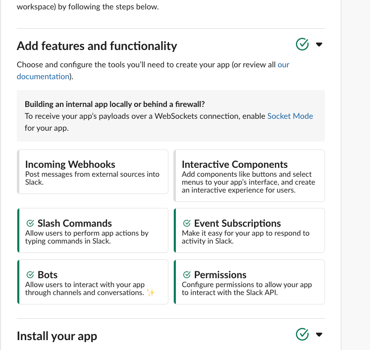
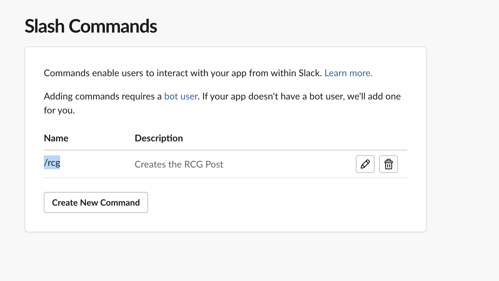

# 🚢 SHIPIT 59: RCG SLACK BOT 🤖 #

The purpose of this Ship-It project is to help solve some of the issues organizers face when organizing an RCG event. 

This project helps users collect emails address of RCG participants and easily create a slack channel with all the participants.

### How do I get set up? ###

* Summary of set up
    * Create a slack app https://slack.dev/bolt-js/tutorial/getting-started
        * set slack to socket mode
        * 
        * Updating event permissions
            * enable the following bot permissions: 
                "channels:history",
                "chat:write",
                "commands",
                "groups:history",
                "im:history",
                "mpim:history",
                "reactions:write",
                "users.profile:read",
                "users:read",
                "channels:manage",
                "groups:write",
                "im:write",
                "mpim:write"

            * slash commands set up slash command for /rcg
            
    * Create a copy of the .env.sample file to save slack environment variables and mongo db variables
    * create a new mongo db database and create a cluster inside. 
    * Start the app by running node app.js
* Configuration
* Dependencies
* Database configuration
* How to run tests
* Deployment instructions

### Extensions ###

However, there are many extensions that I hope to implement including the ability to customize button messages and implement slack channel Naming validation.

### Who do I talk to? ###

This project was made by Karyna! (kyen@atlassian.com)

